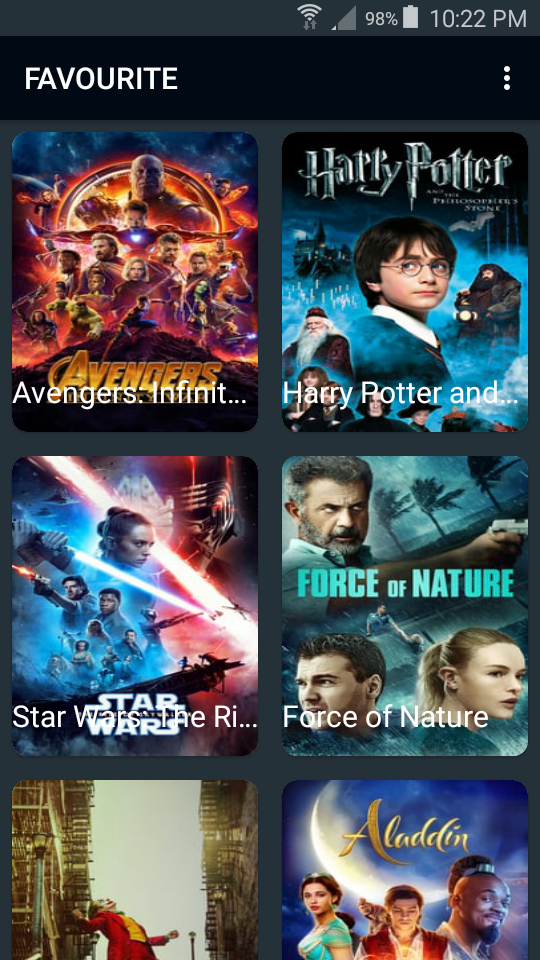
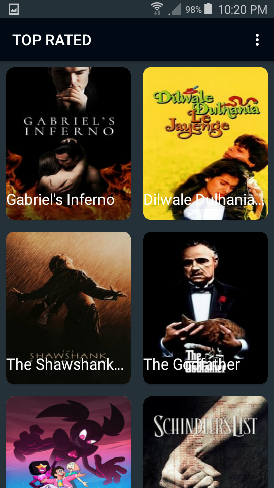
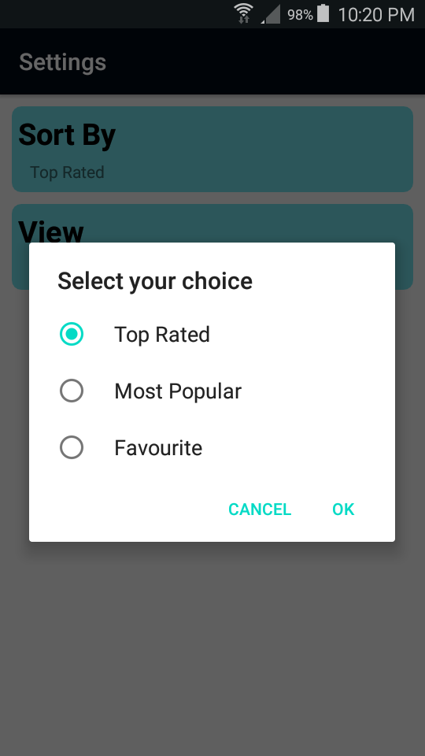
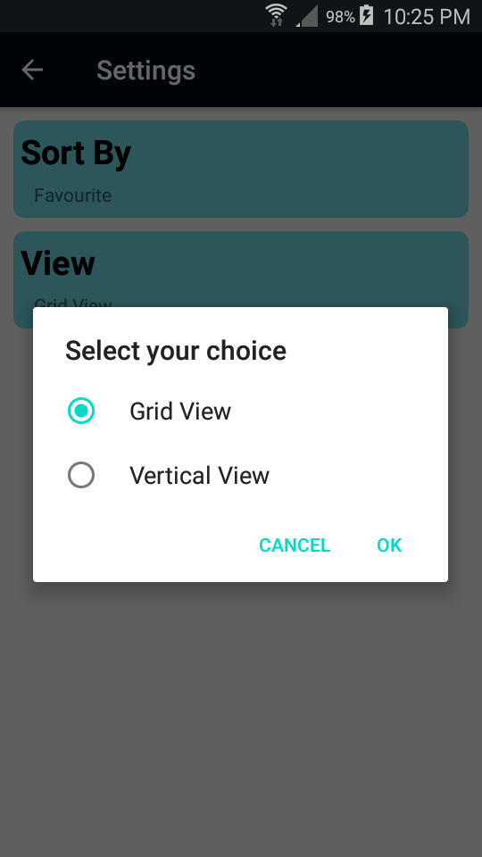
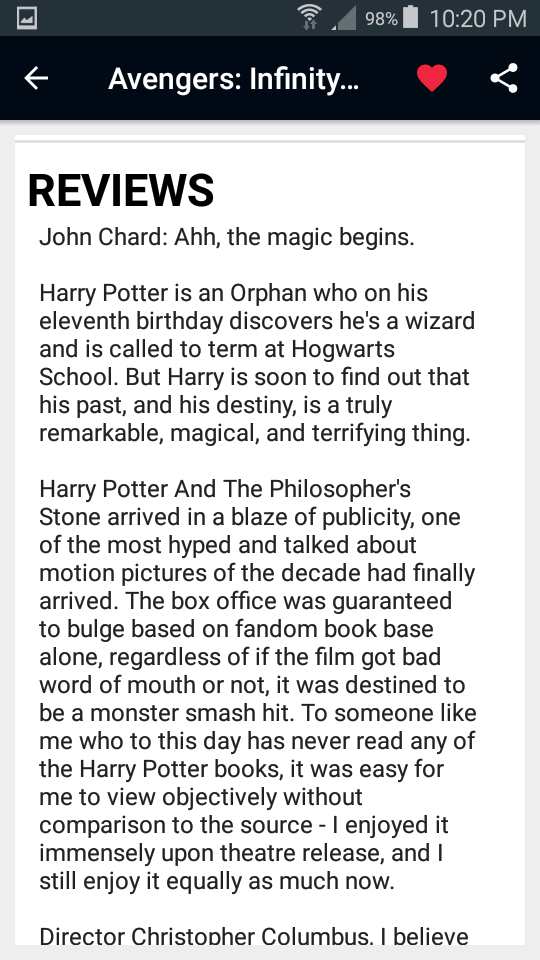
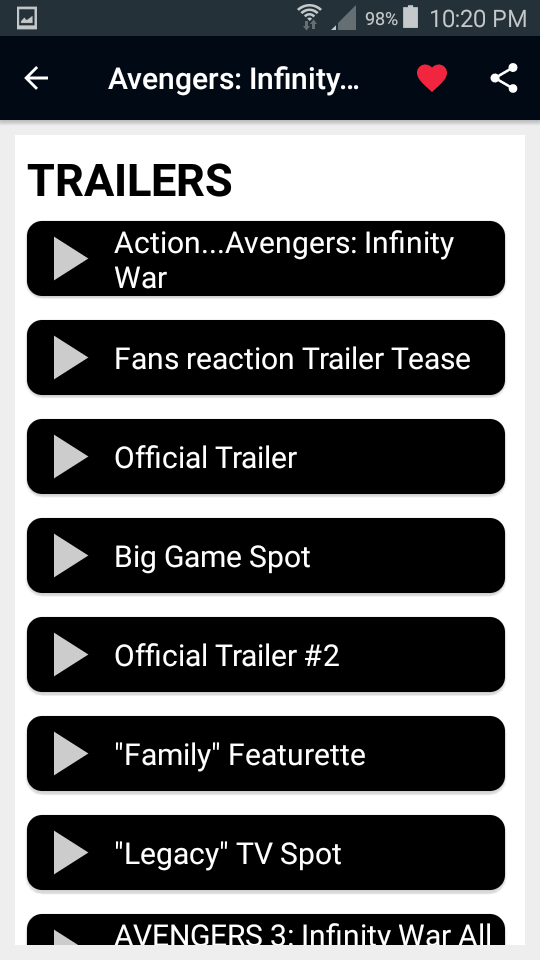
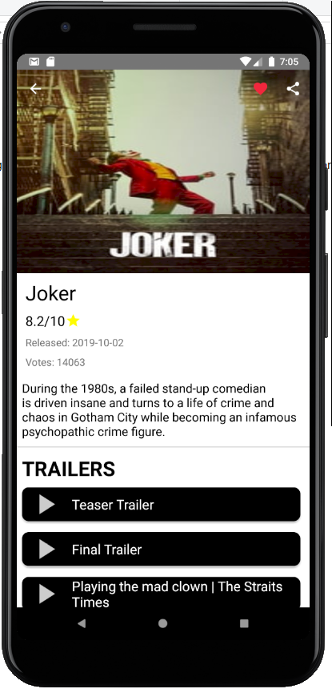
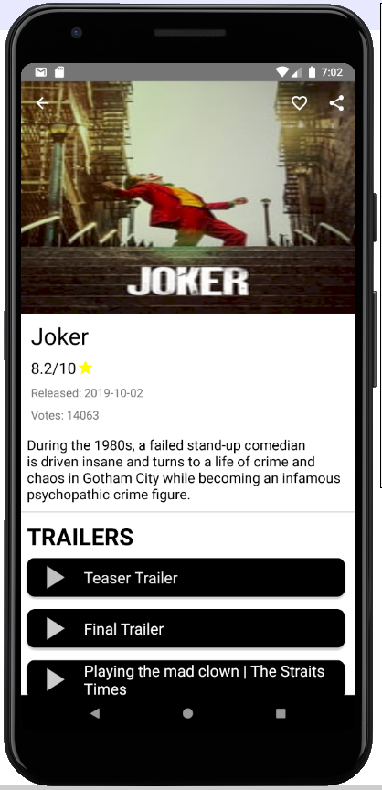
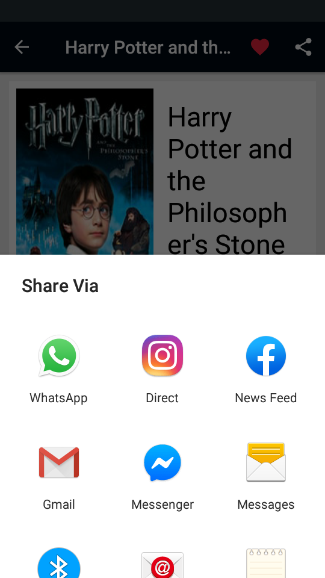

# Movie-App
This App uses "The Movie Database"
First you need to get your api key from https://www.themoviedb.org/ then clone the project and follow the TODO task

# General Features
- Popular movies.
- Top rated movies.
- Make your own favourite list movies.
- View movies in Grid or Vertical view.

# Screen shots

### Favourite movies

### Top rated movies

### Settings

### Movie reviews

### Movie trailers

### Movie details after adding to favoutire

### Movie details before adding to favoutire

### Populars movies 

### Share movie 

